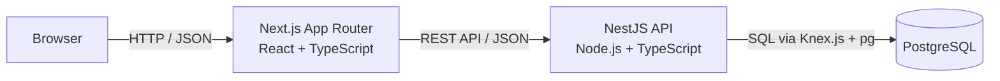

# Dhaka Tesla Pool

A ride-pooling MVP for Dhaka's informal battery-powered "Tesla" vehicles.

## Story

* **Jashim** — Driver
* **Bullet** — 3-seat battery-powered Tesla
* **Nusrat** — Passenger, Banani → Mohakhali
* **Rafiq** — Passenger, Banani → Gulshan 1
* **Shirin** — Passenger involved in the last-seat concurrency scenario

## Technology

* **Backend:** Node.js + TypeScript + NestJS
* **Frontend:** Next.js App Router + TypeScript
* **Database:** PostgreSQL
* **Database Access:** Knex.js + pg
* **Authentication:** JWT + Passport + bcrypt
* **Validation:** class-validator + class-transformer
* **Testing:** Jest
* **Containerization:** Docker + Docker Compose

## Architecture

### System Architecture

## Development Status

**Phase 1 — Project Initialization & Architecture**

🟡 **In Progress**
