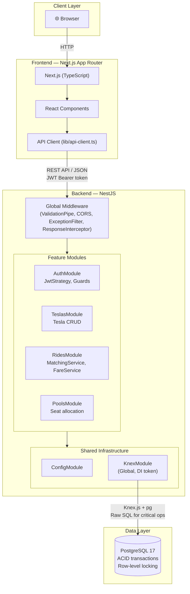
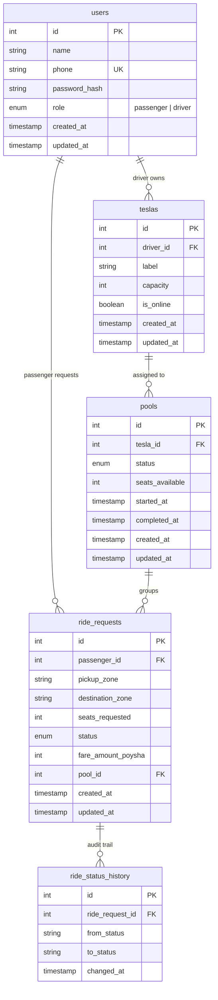

# Dhaka Tesla Pool

A ride-pooling MVP for Dhaka's informal battery-powered "Tesla" (battery-rickshaw) vehicles.

## The Story

* **Jashim** — Driver, owns a battery-powered Tesla called **Bullet** (3 seats).
* **Nusrat** — Passenger, books Banani → Mohakhali.
* **Rafiq** — Passenger, books Banani → Gulshan 1 (overlapping route, same time as Nusrat).
* **Shirin** — Passenger, tries to grab the last seat ~30 seconds after Rafiq — the deliberate concurrency/race-condition scenario.

## Technology Stack

| Layer | Choice | Why |
|---|---|---|
| **Backend** | Node.js + TypeScript + NestJS | Module/controller/provider architecture with built-in DI, guards, pipes, and exception filters. Gives us OOP/layered structure without re-inventing routing and middleware. |
| **Frontend** | Next.js App Router + TypeScript | React-based with file-system routing, SSR/SSG capabilities, and a clean developer experience. |
| **Database** | PostgreSQL 17 | Relational store with ACID transactions and row-level locking — critical for seat-capacity concurrency safety. |
| **DB Access** | Knex.js + pg | Thin query builder over raw SQL. We see and understand every query, especially the transaction/locking ones. |
| **Auth** | JWT via @nestjs/passport + bcryptjs | Stateless tokens, hashed passwords, role-based guards. |
| **Validation** | class-validator + class-transformer | Declarative DTO validation via decorators, enforced by a single global ValidationPipe. |
| **Testing** | Vitest | Faster than Jest for ESM/TypeScript projects, native ESM support, compatible API. |
| **Containerization** | Docker + Docker Compose | Postgres + backend + frontend in one `docker compose up`. |

## Architecture

### System Architecture



### Entity Relationship Diagram



## Project Structure

```
dhaka-tesla-pool/
├── backend/
│   ├── src/
│   │   ├── main.ts                    # NestJS entrypoint (ValidationPipe, CORS, prefix)
│   │   ├── app.module.ts              # Root module (composition root)
│   │   ├── health.controller.ts       # GET /api/health
│   │   ├── config/
│   │   │   └── configuration.ts       # Typed env config factory
│   │   ├── database/
│   │   │   ├── knex.module.ts         # Global Knex DI provider
│   │   │   ├── knex.constants.ts      # KNEX_CONNECTION Symbol token
│   │   │   ├── migrations/            # Schema versioning
│   │   │   └── seeds/                 # Demo data (Jashim, Nusrat, etc.)
│   │   ├── auth/                      # Authentication module (Phase 5)
│   │   ├── teslas/                    # Tesla/driver module (Phase 6)
│   │   ├── rides/                     # Ride request module (Phase 7-9)
│   │   ├── pools/                     # Pool management module (Phase 8)
│   │   └── common/                    # Shared filters, interceptors, types, utils
│   ├── test/                          # E2E tests
│   ├── knexfile.ts                    # Knex CLI config (shares configuration.ts)
│   ├── Dockerfile
│   ├── tsconfig.json
│   └── vitest.config.ts
├── frontend/
│   ├── app/                           # Next.js App Router pages
│   ├── components/                    # (Phase 11-12)
│   ├── lib/                           # API client (Phase 11)
│   └── types/                         # Shared TypeScript types
├── docker-compose.yml                 # Postgres + backend + frontend
├── .env.example                       # Committed — safe defaults, no secrets
└── README.md
```

## Development Status

| Phase | Description | Status |
|---|---|---|
| 1 | Project Initialization & Architecture | ✅ Complete |
| 2 | PostgreSQL + Knex + Docker skeleton | 🔜 Next |
| 3 | Database Schema & ERD | ⬜ |
| 4 | Seed Data | ⬜ |
| 5 | Authentication | ⬜ |
| 6 | Tesla / Driver Module | ⬜ |
| 7 | Ride Request & Matching | ⬜ |
| 8 | Pooling, Capacity & Concurrency Fix | ⬜ |
| 9 | Ride Lifecycle | ⬜ |
| 10 | Error Handling, Validation & Security | ⬜ |
| 11 | Frontend: Passenger Flow | ⬜ |
| 12 | Frontend: Driver Flow | ⬜ |
| 13 | Full Docker Compose | ⬜ |
| 14 | Testing | ⬜ |
| 15 | Documentation | ⬜ |
| 16 | Final Review | ⬜ |

## Quick Start

### Prerequisites

- Node.js 22+
- Docker Desktop (for PostgreSQL)
- Git

### Backend

```powershell
cd backend
npm install
# Start PostgreSQL via Docker
docker compose -f ../docker-compose.yml up postgres -d
# Run migrations (once schema exists)
npm run db:migrate
# Start dev server
npm run start:dev
```

### Frontend

```powershell
cd frontend
npm install
npm run dev
```

### Demo Credentials

| Name | Role | Phone | Password |
|---|---|---|---|
| Jashim | Driver | 01700000001 | jashim123 |
| Nusrat | Passenger | 01700000002 | nusrat123 |
| Rafiq | Passenger | 01700000003 | rafiq123 |
| Shirin | Passenger | 01700000004 | shirin123 |
